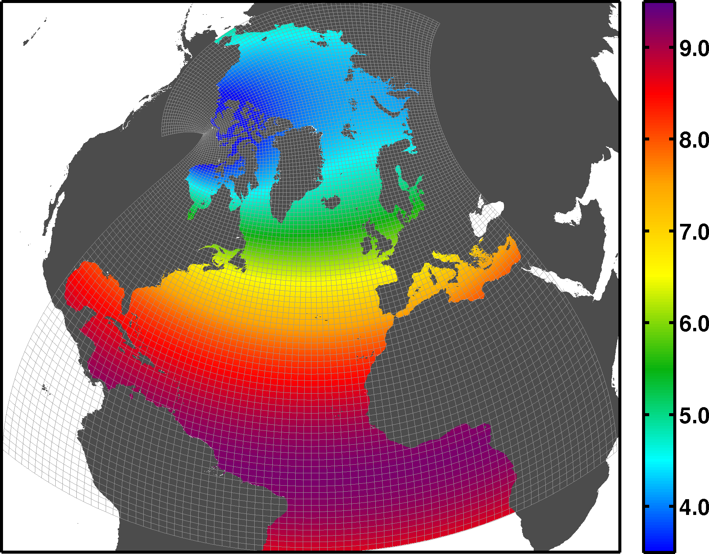

ANHA12
======

ANHA12 is the nearly the same as our `ANHA4 <https://canadian-nemo-ocean-modelling-forum-commuity-of-practice.readthedocs.io/en/latest/Institutions/UofA/Configurations/ANHA4/index.html#anha4>`_  but a horizontal resolution at 1/12 degree.

   ANHA12 horizontal grid spacing

ANHA12 requires much more computing resources than ANHA4, thus only a few simulations have been carried out. We list them below:

.. raw:: html

   <iframe width="740" height="500" src="https://docs.google.com/spreadsheets/d/e/2PACX-1vRpBSqIbq8np8TladN9wRxKWaZDGLDfttz7oBASybI6lD-E0Kg_hXdQAWqfVic91WVjlqhR0qUvqQR8/pubhtml?gid=507064585&amp;single=true&amp;widget=true&amp;headers=false"></iframe>

