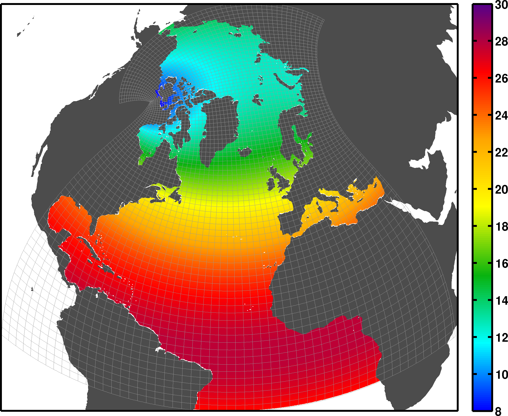

ANHA4
=====

ANHA is our acronym for the Arctic and Northern Hemisphere Atlantic configuration of the NEMO model. It covers the entire Arctic and Northern Atlantic Ocean, and a portion of the Southern Atlantic. The ANHA configuration has open boundaries across Bering Strait in the Arctic, as well as in the Southern Atlantic Ocean across the 20 degree south latitude. ANHA was designed to be a subset of the ORCA global grid, allowing us to use a regional configuration to use much less computing resources (RAM + CPU time) to carry out our research and development purposes.

Here we show the 1/4 degree resolution ANHA configuration (ANHA4)

   ANHA4 horizontal grid spacing

ANHA4 is our low resolution regional configuration that affords us a low-cost, eddy-permitting simulation. Such simulations are particularly useful for any sensitivity studies since we can finish a multi-decade simulation within a month or so. ANHA4 has been a very productive configuration. Its fast simulation time allows us to test all sorts of new model development, parameter testing, coupled systems. Here is our incomplete listing of our ANHA4 simulations with some useful information:
 
|
ANHA4 simulations:

.. raw:: html

   <iframe width="740" height="500" src="https://docs.google.com/spreadsheets/d/e/2PACX-1vRpBSqIbq8np8TladN9wRxKWaZDGLDfttz7oBASybI6lD-E0Kg_hXdQAWqfVic91WVjlqhR0qUvqQR8/pubhtml?gid=0&amp;single=true&amp;widget=true&amp;headers=false"></iframe>

|
ANHA4 simulations with Tides:

.. raw:: html

   <iframe width="740" height="500" src="https://docs.google.com/spreadsheets/d/e/2PACX-1vRpBSqIbq8np8TladN9wRxKWaZDGLDfttz7oBASybI6lD-E0Kg_hXdQAWqfVic91WVjlqhR0qUvqQR8/pubhtml?gid=1612333202&amp;single=true&amp;widget=true&amp;headers=false"></iframe>
   
|   
ANHA4 BaySys Climate simulations:

.. raw:: html

   <iframe width="740" height="500" src="https://docs.google.com/spreadsheets/d/e/2PACX-1vRpBSqIbq8np8TladN9wRxKWaZDGLDfttz7oBASybI6lD-E0Kg_hXdQAWqfVic91WVjlqhR0qUvqQR8/pubhtml?gid=239993208&amp;single=true&amp;widget=true&amp;headers=false"></iframe>
   
|
ANHA4 simulations with 75 vertical levels:

.. raw:: html

   <iframe width="740" height="500" src="https://docs.google.com/spreadsheets/d/e/2PACX-1vRpBSqIbq8np8TladN9wRxKWaZDGLDfttz7oBASybI6lD-E0Kg_hXdQAWqfVic91WVjlqhR0qUvqQR8/pubhtml?gid=1661009051&amp;single=true&amp;widget=true&amp;headers=false"></iframe>
   
|
ANHA4 ice shelf melt

.. raw:: html

   <iframe width="740" height="500" src=https://docs.google.com/spreadsheets/d/e/2PACX-1vRpBSqIbq8np8TladN9wRxKWaZDGLDfttz7oBASybI6lD-E0Kg_hXdQAWqfVic91WVjlqhR0qUvqQR8/pubhtml?gid=1346136275&amp;single=true&amp;widget=true&amp;headers=false"></iframe>

|
ANHA4 Icebergs

.. raw:: html

   <iframe width="740" height="500" src=https://docs.google.com/spreadsheets/d/e/2PACX-1vRpBSqIbq8np8TladN9wRxKWaZDGLDfttz7oBASybI6lD-E0Kg_hXdQAWqfVic91WVjlqhR0qUvqQR8/pubhtml?gid=1055545507&amp;single=true&amp;widget=true&amp;headers=false"></iframe>
   
|

more to come

   
