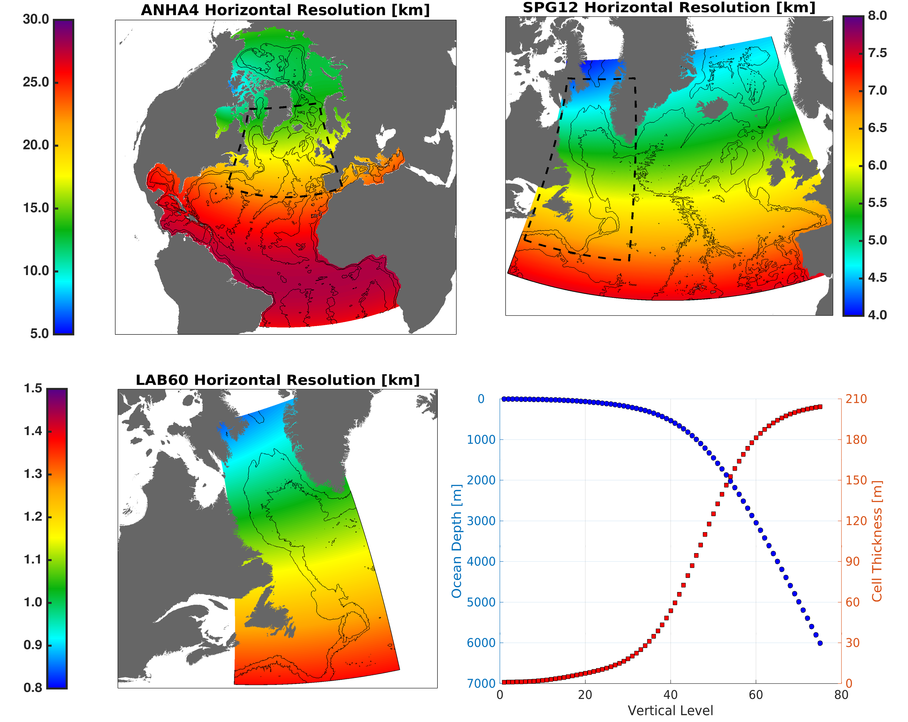

LAB60
=====

The ANHA4-SPG12-LAB60 configuration (LAB60 for short) features a regional ANHA4 parent domain with 2 2-way nests. One nest takes places within the North Atlantic sub-polar gyre (very similar to our ANHA4-SPG12 configuration), with another nest inside the first nest. The intermediate nest in the sub-polar gyre increases the horizontal resolution threefold (to 1/12 degree), and the final nest in the Labrador Sea further increases the horizontal resolution by 5-fole (to 1/60 degree). All domains within this configuration share an identical vertical structure of 75 levels where the surface layers are the shallowest, with deeper grids progressively thicker.

The full documentation for this configuration can be found within `Geoscientific Model Development <https://doi.org/10.5194/gmd-13-4959-2020>`_.

We have three LAB60 simulations, `click here <https://canadian-nemo-ocean-modelling-forum-commuity-of-practice.readthedocs.io/en/latest/Institutions/UofA/Model_Development/AGRIF/index.html#agrif>`_ to see them within our AGRIF list. All our LAB60 simulations use the same base setup including horizontal/vertical grid spacing:

   The horizontal and vertical grid spacing for each domain of our LAB60 configuration.

|
The following videos were taken from the LAB60-DFS simulation (ANHA4-ECP017), our "main" LAB60 simulation since the first one (ANHA4-ECP007) had a Labrador Sea which was a bit too strongly stratified for deep convection to occur, likely driven by weaker air-sea heat fluxes from the CMC GDPS atmospheric forcing. Our third LAB60 simulation (ANHA4-ECP027) has no runoff emitted from Greenland and was designed as a sensitivity study to explore the influence of Greenland's runoff on the Labrador Sea.

.. raw:: html

   <iframe width="740" height="500" src="https://ualberta.aviaryplatform.com/embed/media/164191 " allow="fullscreen" frameborder="0"></iframe>
   
   Video Caption: Greenland runoff passive tracer

|
.. raw:: html

   <iframe width="740" height="500" src="https://www.youtube.com/embed/TtaZIwaO57w" title="YouTube video player" frameborder="0" allow="accelerometer; autoplay; clipboard-write; encrypted-media; gyroscope; picture-in-picture" allowfullscreen></iframe>
   
   Video Caption: Irminger Water passive tracer

|
.. raw:: html

   <iframe width="740" height="500" src="https://www.youtube.com/embed/rK62guzG3cM" title="YouTube video player" frameborder="0" allow="accelerometer; autoplay; clipboard-write; encrypted-media; gyroscope; picture-in-picture" allowfullscreen></iframe>
   
   Video Caption: LSW passive tracer

|
.. raw:: html

   <iframe width="740" height="500" src="https://www.youtube.com/embed/QCDoyX_QZao" title="YouTube video player" frameborder="0" allow="accelerometer; autoplay; clipboard-write; encrypted-media; gyroscope; picture-in-picture" allowfullscreen></iframe>

   Video Caption: LAB60 Vorticity

|
.. raw:: html

   <iframe width="740" height="500" src="https://www.youtube.com/embed/JMFL7OSVOP0" title="YouTube video player" frameborder="0" allow="accelerometer; autoplay; clipboard-write; encrypted-media; gyroscope; picture-in-picture" allowfullscreen></iframe>

   Video Caption: LAB60 freshwater content

|
.. raw:: html

   <iframe width="740" height="500" src="https://www.youtube.com/embed/gTkzgQKRnWo" title="YouTube video player" frameborder="0" allow="accelerometer; autoplay; clipboard-write; encrypted-media; gyroscope; picture-in-picture" allowfullscreen></iframe>

   Video Caption: LAB60 Mixed layer depth

|
.. raw:: html

   <iframe width="740" height="500" src="https://www.youtube.com/embed/Q3yKIHNPy_g" title="YouTube video player" frameborder="0" allow="accelerometer; autoplay; clipboard-write; encrypted-media; gyroscope; picture-in-picture" allowfullscreen></iframe>

   Video Caption: LAB60 Stratification

