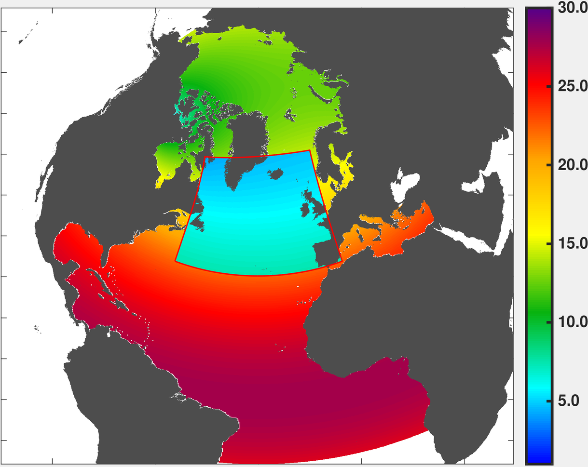

SPG12
-----

ANHA4-SPG12 is a regional `ANHA4 <https://canadian-nemo-ocean-modelling-forum-commuity-of-practice.readthedocs.io/en/latest/Institutions/UofA/Configurations/ANHA4/index.html#anha4>`_ configuration with a single `AGRIF <https://canadian-nemo-ocean-modelling-forum-commuity-of-practice.readthedocs.io/en/latest/Institutions/UofA/Model_Development/AGRIF/index.html#agrif>`_ nest in the North Atlantic Subpolar gyre, bringing local resolution to 1/12 of a degree. This and all of our AGRIF simulations use two-way feedback: the ANHA4 parent domain provides the boundary conditions for the SPG12 nest each model timestep; The SPG12 nest supplies its' solution back to the ANHA4 parent domain

   SPG12's horizontal grid spacing
