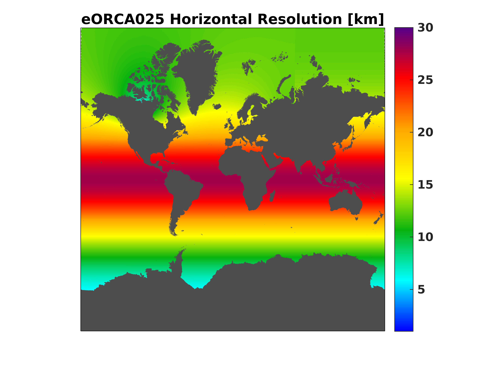

eORCA025
========

eORCA025 Video:

.. raw:: html

   <iframe width="560" height="315" src="https://www.youtube.com/embed/UWCtsptjsPI" title="YouTube video player" frameborder="0" allow="accelerometer; autoplay; clipboard-write; encrypted-media; gyroscope; picture-in-picture" allowfullscreen></iframe>

Movie Caption: Simple video showing 4 simulations of our eORCA025 configuration. Shown is the surface speed as output every 5 days from the years 1993 through the end of 1995.
