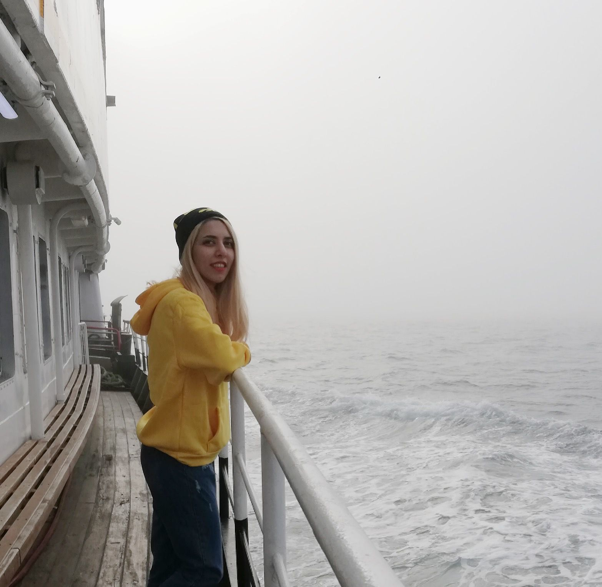
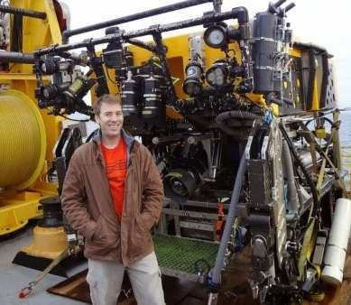
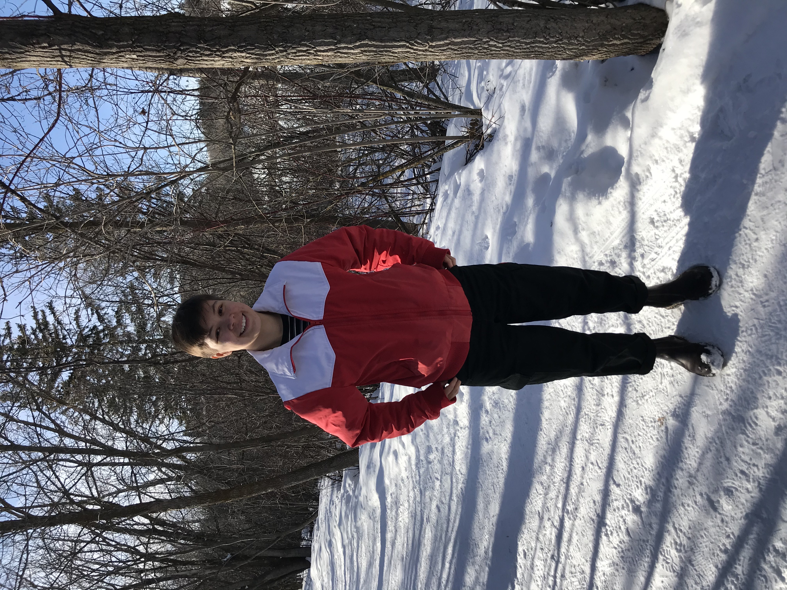
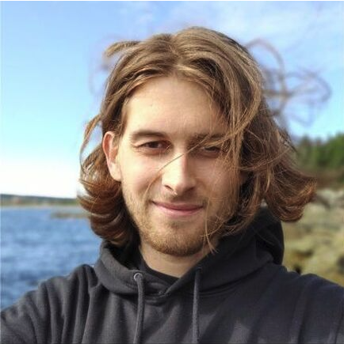
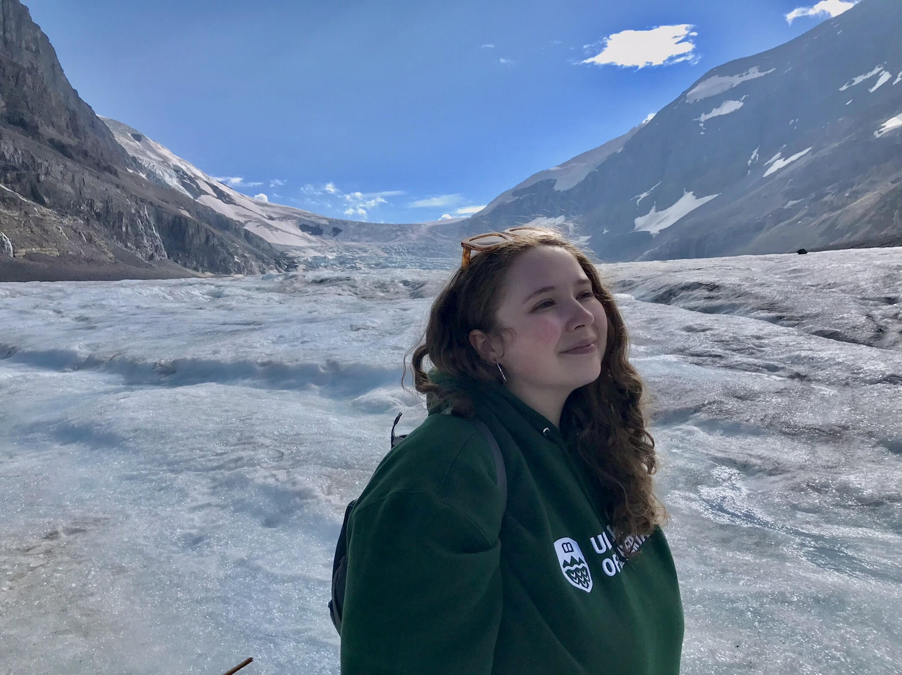

Lab Members
===========

Present Members
---------------

* Pouneh Hoshyar: I'm a Ph.D. student working with Dr. Myers, focusing on very high-resolution modelling of the Labrador Sea. My research aims to deepen our understanding of how changes in this critical region can affect the Atlantic Meridional Overturning Circulation and global climate. With a background in Civil Engineering, including a BSc and MSc, with a specialization in Water and Hydraulic Structures, I bring a unique perspective to my work. Through my research, I am eager to contribute towards a more sustainable future, one in which we prioritize both scientific discovery and the preservation of our planet.

* Clark Pennelly: I'm currently a postdoctoral fellow with Paul Myers, where I spend most of my time developing new NEMO model configurations, updating our lab to newer NEMO versions,  building this website, and addressing any issues our lab members have with NEMO. I finished my PhD on modelling stratification within the Labrador Sea with Paul Myers in 2021, and before that I worked with Paul as a research assistant, setting up and carrying out numerical simulations using the AGRIF nesting software

.. figure:: adam_headshot.jpg
    :align: right
    :figwidth: 200px

* Chuanshuai (Adam) Fu: I study physical oceanography. I work with the numerical output from the coupled ocean/sea ice model NEMO to analyze key processes and variability, explaining how the ocean evolves and interacts with the atmosphere. My MSc project was to investigate how the warm and saline Atlantic Water alters as it flows into the Arctic Ocean through Fram Strait and the Barents Sea Opening. My current projects involve modelling the Beaufort Gyre system and the interaction between sea ice and eddies in the Labrador Sea in very high-resolution (submesoscale) models.

|

* Hannah Louis: I'm currently a MSc student with Dr. Myers working on understanding climate change in the Hudson and James Bay region using NEMO. In my free time, you can find me either bouldering, training in the boxing gym, or trying to improve my espresso making. 

|

|

|

|

* Rowan Brown: I am a master’s student working on modelling the Labrador Sea under the supervision of Dr Paul Myers. Ironically, I recently moved here from Newfoundland and Labrador where I was working as an ocean engineer.

|

|

|

|

* I am a double major in Earth and Atmospheric Sciences and Physics at the University of Alberta, completing my undergraduate thesis with Dr. Myers’ lab. My research focuses on the northern Canadian Arctic Archipelago region, studying the evolution of the Arctic Ocean and sea ice as represented in models. I am very passionate about arts and science communication, and love engaging with the local community through my job at the TELUS World of Science Edmonton. I hope to continue my education with a focus on physical climate, eventually becoming involved with climate policy.

.. figure:: tahya_photo.jpg
    :align: right
    :figwidth: 200px

* Tahya Weiss-Gibbons: I am currently a PhD student with Dr. Paul Myers, and I am interested in understanding climate change in the Arctic through modelling. Currently I study atmosphere-ocean interactions in high resolution coupled climate model simulations. I also previously completed my Masters degree with Paul, looking at the sensitivity of the Arctic Ocean to changes in river runoff. 

|

|

|

Monica Figueroa: Monica is a fourth year undergraduate physics student at the University of Alberta doing her 499 thesis project with Dr. Myers. The goal of her research project is to characterize the variability of sea ice, ocean heat content and circulation in Sverdrup Basin over the past 50 years. In her free time, Monica enjoys baking and making pottery.

|

|

|

Past Members
------------

* Laura Gillard: Previous PhD student (2020) and Masters student (2015) with Paul Mayers. Now working as a Post Doctoral Fellow at the Centre for Earth Observation Science (CEOS) at the University of Manitoba. To be updated on current works, please visit my `Google Scholar page  <https://scholar.google.ca/citations?hl=en&user=N7EQUeMAAAAJ&view_op=list_works&sortby=pubdate>`_ or `ResearchGate <https://www.researchgate.net/profile/Laura-Gillard-2>`_ 

* Nathan Grivault: I was a PhD student, and briefly a post-doc, under Paul Myers supervision. My main research focus was the freshwater fluxes out of the Arctic towards the northern Atlantic region, and in particular the role of Baffin Bay and the Canadian Arctic Archipelago. Currently working as a geophysical developer at the Swedish Meteorological and Hydrological Institute (SMHI) in the Oceanographic Research unit.

|

* Pasha Karami: `Pasha's SMHI page <https://www.smhi.se/en/research/research-departments/climate-research-at-the-rossby-centre/pasha-karami-1.112947>`_ 
