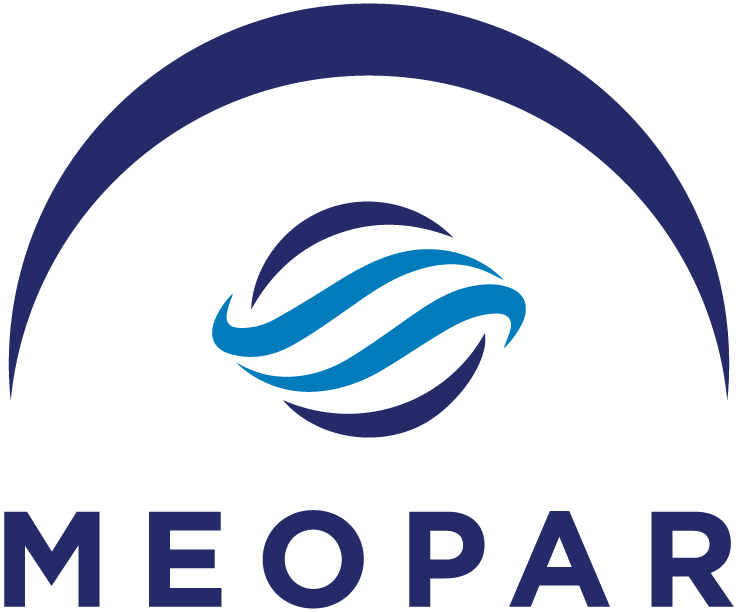
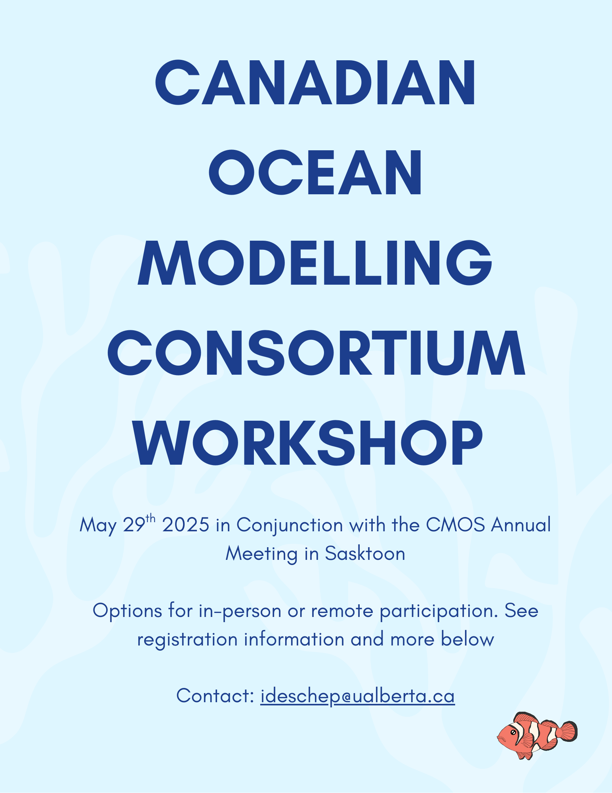

***************************************
NEMO Ocean Modelling Forum Community of Practice
***************************************

Welcome to the NEMO Ocean modelling forum Community of Practice. The goals of this site is to encourage collaboration across Canadian institutions to share our NEMO modelling progress, development, code, accomplishments, successes and failures, and many other aspects. This is one of the `Communities of Practice <https://meopar.ca/wp-content/uploads/2022/08/MEOPAR-infographic-poster-web-pdf.jpg>`_ that `MEOPAR <https://meopar.ca/>`_ supports. Click `here <https://meopar.ca/knowledge-mobilization/communities-of-practice/>`_ to see the other Communities of Practice. Interested members/groups can reach Clark Pennelly (pennelly AT ualberta.ca) or Paul Myers (pmyers AT ualberta.ca)

Contents
========

Join our `our Slack channel <https://nemocanadaforum.slack.com>`_.

.. toctree::
   :maxdepth: 1
   
   Institutions/index
   Instructions
   Sources
   Groups
   Seminar

Upcoming Events
===============

Canadian Ocean Modelling Consortium Workshop
--------------------------------------------

Please register for the workshop using this `link <https://docs.google.com/forms/d/e/1FAIpQLSfhg_Pyq5m8e3ivFNN6g5f1WRg9XY5GRcl-zsMeLzQKJmbUIw/viewform?usp=dialog>`_.

Events Calendar
---------------

.. raw:: html

   <iframe width="740" height="500" src="https://calendar.google.com/calendar/embed?src=nemouofa%40gmail.com&ctz=America%2FEdmonton" style="border: 0" frameborder="0" scrolling="no"></iframe> 
   

This website is under active development.
