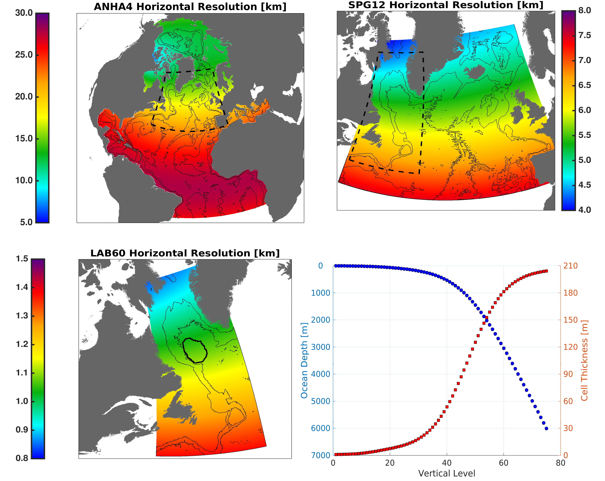

***************************************
NEMO Ocean Modelling Forum Commuity of Practice
***************************************
NEMO is the ocean modelling framework used at the University of Alberta. We are in the progress of updating our previous website into what you see here using readthedocs.org ,gitlab.com, and sphinx.

Lets add a figure

Figure Caption: The horizontal and vertical grid spacing for each domain of our LAB60 configuration.

And another figure!

.. figure:: _figures/grid_ARC60.png

Figure Caption: The horizontal grid spacing of our ARC60 configuration.
|

What about a movie from youtube?

.. raw:: html

   <iframe width="560" height="315" src="https://www.youtube.com/embed/UWCtsptjsPI" title="YouTube video player" frameborder="0" allow="accelerometer; autoplay; clipboard-write; encrypted-media; gyroscope; picture-in-picture" allowfullscreen></iframe>

Movie Caption: Simple video showing 4 simulations of our eORCA025 configuration. Shown is the surface speed as output every 5 days from the years 1993 through the end of 1995.

How to make a note?

.. note:: This is a note admonition.
   This is the second line of the first paragraph.

   - The note contains all indented body elements
     following.
   - It includes this bullet list.
    
    
    
Join our `our Slack channel <https://nemocanadaforum.slack.com>`_.

Contents
========

.. toctree::
   :maxdepth: 2
   
   Groups
   Slack
   Sources

